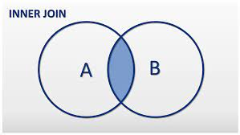
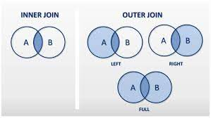

# Relationship between data; tables, columns, rows.

Associations between two or more db instances. They can be tables, columns or rows

## Types:

### One to one:

**Every** registry from _Table A_ it's **related** to **one** registry from _table B_.

**Every** registry from _Table B_ it's **related** to **one** registry from _Table A_

### One to many:

**One** registries from _Table A_ can be **related** to **one or many** registries from _table B_.

**Many** registries from _Table B_ can be **related** to **one** registry from _Table A_

Most of the relationships in most of the databases are **one to many**

### Many to many:

**One or many** registries from _Table A_ can be **related** to **one or many** registries from _table B_.

**One or many** registries from _Table B_ can be **related** to **one or many** registries from _Table A_

Most of the DB managers dont' support many to many relationships.The workarund can be done creating a intermediary table

## Identifiers/ keys

The type of key will depends on which table you are in:

EG:

- Table COMPUTERS
    - Have a computer_id col
        - This is the primary key when you're inside this table
    - Have a brand_id col
        - This is a foreign key when you're inside this table
    - Have a product_type_id col
        - This is a foreign key when you're inside this table
- Table PRODUCT_TYPE
    - product_type_id
        - This is primary key when you're inside this table
- Table BRANDS
    - Have a brand_id col
        - This is a primary key when you're inside this table
    - Have a product_type_ids
        - This is an array of foreign keys

### Primary key:

Property that will identify a unique registry in one or multiple entity.

Based on a specific field we assign in our database

### Foreign key:

Identify a registry in an external table

## Joins:

When you have different conjuncts

### Innner join

Data that we have on TABLE_A and TABLE_B

### Outer join

#### Left join

All the data present in TABLE_A

When you run this query   **LEFT JOIN** you'll bring data present in TABLE_B

When you use **LEFT OUTER JOIN** you'll bring data present in TABLE_A but not in TABLE_B

#### Right Join

All the data present in TABLE_B

To get all data from TABLE_B you can use **RIGHT JOIN**

To get all data that are not in TABLE_A we'll use **RIGHT OUTER JOIN**

#### Full Outer Join

To get all data from one or another, but not coincident

