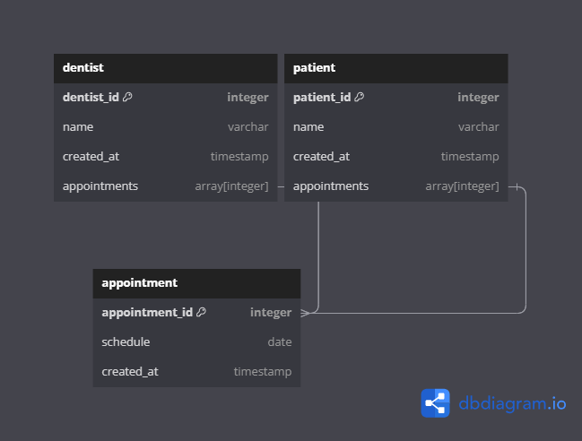

# Homework
### Dentist appointments


``````dbml
Table dentist {
  dentist_id integer [primary key]
  name varchar
  created_at timestamp 
  appointments array[integer] 
}

Table patient {
  patient_id integer [primary key]
  name varchar
  created_at timestamp
  appointments array[integer] 
}

Table appointment {
  appointment_id integer [primary key]
  schedule date
  created_at timestamp
}

Ref: dentist.appointments < appointment.appointment_id
Ref: patient.appointments < appointment.appointment_id

``````


### Hours p/ project


``````dbml
Table Project {
  project_id integer pk
  hours_used float
  name varchar
  employee_assigned integer
  office_assigned integer
}

Table Employee{
  employee_id integer pk
  name varchar
  rfc varchar
}

Table Office{
  office_id integer pk
  name varchar
}

Ref: Employee.employee_id > Project.employee_assigned
Ref: Office.office_id > Project.office_assigned
tment_id

``````
